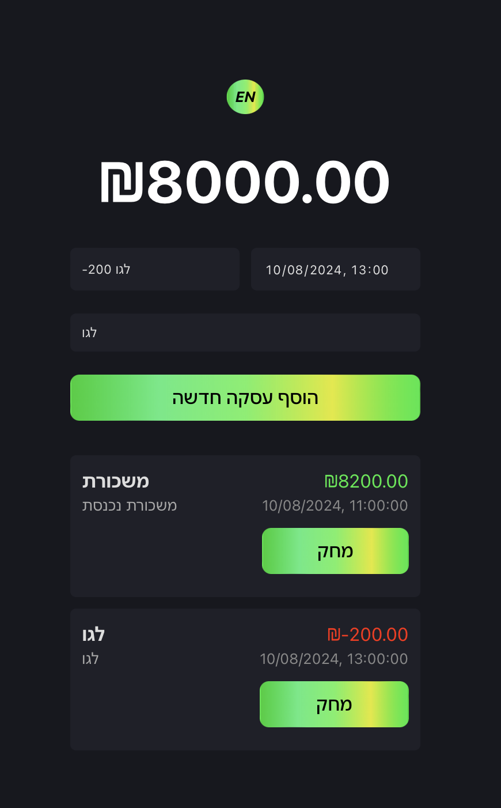

# Finance Tracker

A full-stack finance tracking application that allows users to manage their transactions, view their balance, and switch between English and Hebrew languages.

## Features

- **Transaction Management**: Add, view, and delete transactions.
- **Balance Calculation**: Automatically updates the balance based on added and deleted transactions.
- **Language Support**: Switch between English and Hebrew with a toggle button.
- **Responsive Design**: Optimized for desktop, tablet, and mobile screens.

## Tech Stack

- **Frontend**: React, CSS
- **Backend**: Node.js, Express
- **Database**: MongoDB (via Mongoose ODM)
- **Other**: Vite for development server, CORS for handling cross-origin requests.

## Getting Started

### Prerequisites

- Node.js (version 14 or higher)
- npm or yarn
- MongoDB Atlas account (or a locally installed MongoDB server)

## Installation

### Prerequisites

Before you begin, ensure you have met the following requirements:

- **Node.js**: You should have Node.js installed, ideally version 14 or higher. You can download it from [nodejs.org](https://nodejs.org/).
- **npm**: npm comes bundled with Node.js, so you should already have it if you've installed Node.js.
- **MongoDB**: You will need access to a MongoDB database. You can either use [MongoDB Atlas](https://www.mongodb.com/cloud/atlas) or set up MongoDB locally on your machine.

### Step 1: Clone the Repository

Clone this repository to your local machine using:

```bash
git clone https://github.com/Roychen651/MERN-Finance-Tracker.git
cd finance-tracker
cd server
npm install
cd ../client
npm install
npm start
npm run dev
```
## 🚀 Usage

- **Add a Transaction**: Enter the transaction details in the input fields and click "Add New Transaction".
- **Delete a Transaction**: Click the "Delete" button next to a transaction to remove it.
- **Switch Language**: Click the "HE" button to switch between English and Hebrew.

## 📂 Project Structure

- **`client/`**: Contains the React frontend code.
- **`server/`**: Contains the Node.js backend code.
- **`models/Transaction.js`**: Defines the Mongoose schema for a transaction.

## 🖼️ Screenshot



## 🐛 Known Issues

- The application assumes the user enters valid numeric values in the "name" field for the price.
- Deleting a transaction does not update the balance until the next transaction is added or another transaction is deleted.

## 📜 License

This project is licensed under the MIT License - see the [LICENSE](./LICENSE) file for details.

## 🤝 Contributing

Contributions are welcome! Please open an issue or submit a pull request.

